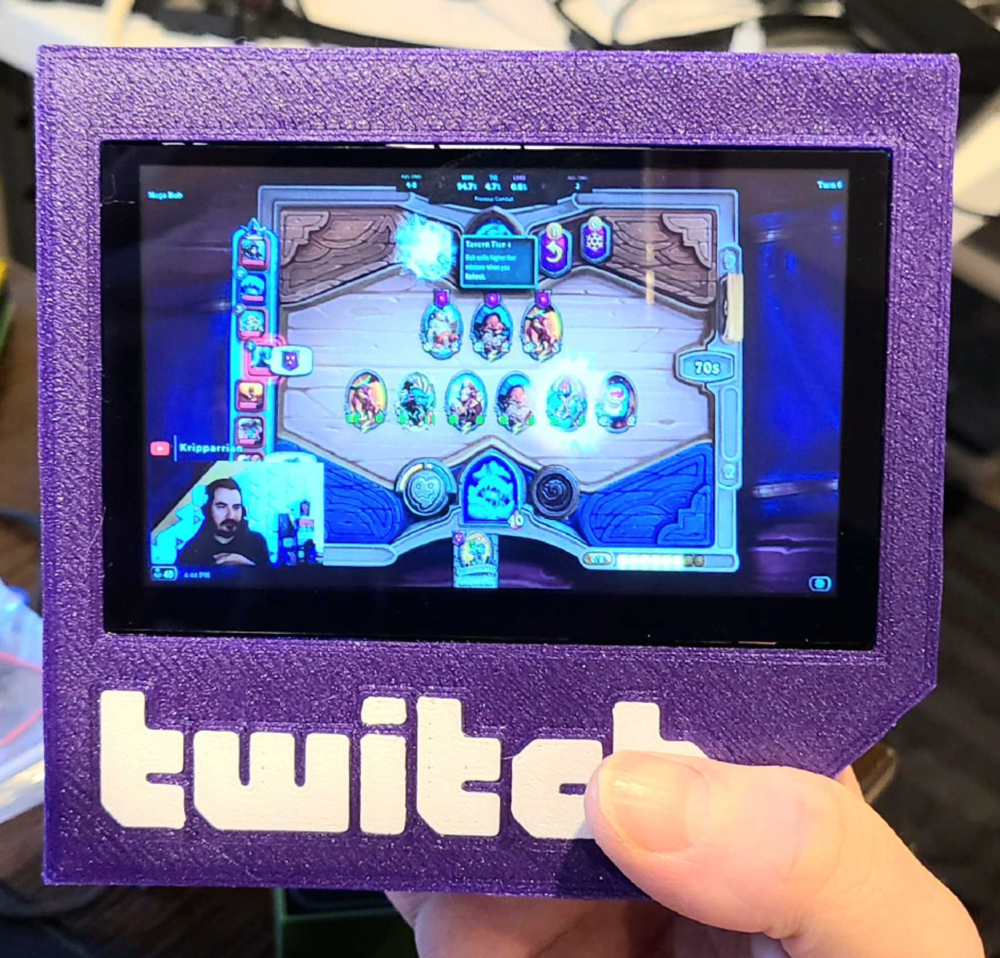

# twitch.tv TV

## What?

Do you love watching twitch streams, but hate how their website lowers your max FPS while fragging n00bz in UT2k4? Do you wish you had a small purple box that would play your favorite streamer whenever they streamed, even at 3am, immediately at max volume? What a weird wish, you weirdo. Jesus.

Anyways here's the twitch.tv TV, a twitch.tv TV made to look like twitch.tv that plays twitch.tv on its uh... monitor.

[Demonstration video](https://www.youtube.com/watch?v=fUFpOonwDaY)

## What You Need

1. 1x [ELECROW Raspberry Pi Monitor 5 Inch Touchscreen IPS Display 800x480 USB Powered HDMI Monitor with Built-in Speaker & Stand for Raspberry Pi Jetson Nano Win PC](https://www.amazon.com/gp/product/B08343QX67/ref=ppx_yo_dt_b_search_asin_title)
2. 1x Raspberry pi (good luck)
2. 1x [USB power source](https://www.amazon.com/gp/product/B07W8XHMJZ/)
3. 1x [high-quality 7/8" bunghole gasket (optional)](https://www.amazon.com/gp/product/B07BNCZ1QJ/)

## How it works

All hardware is plug-and-play. On the software side Streamlink does the heavy lifting, all I've done is make it play continuously in a systemd service. 

### 3d printing + assembly

I use a cute technique to do multicolor printing on a single-extruder printer that I learned in [this](https://www.youtube.com/watch?v=KV2AjyowXX4) video. The trick is to print the letters in white, leave them on the plate, switch to purple (Prusa Galaxy purple if you want the same sparkles) and print the front case with the letters still stuck to the print bed. They are one layer tall so the printer won't smash into them while printing, but it's best to either turn auto bed leveling off or print them in a location where they won't interfere.

The back panel press-fits into the front, and the bunghole gasket squish-fits into the bunghole. The screen installs with the included screws; it _can_ install right-side-up but I couldn't find a right-angle USB-C adapter small enough to fit, so I just installed it upside-down.

### Software installation

1. Use the latest version of raspbian with VLC. make sure to add `hdmi_force_hotplug=1` and `hdmi_drive=2` into `boot.txt`. Install `streamlink`. Rotate the screen using the OS's graphical interface, it's way easier that way. There are ways to disable the task bar, but you can also just hide it in preferences if you don't mind it showing up on boot. There are also many ways to disable the mouse cursor; I think I used [this](https://forums.raspberrypi.com/viewtopic.php?t=234879#p1871765) solution.
2. Place `twitch_tv_tv.sh` in `/home/pi/` and make it executable. If you wish to change the streamer that's being tracked, modify this line: `/usr/bin/streamlink twitch.tv/nl_kripp 480p --player-continuous-http --hls-segment-threads=3 --player "vlc -f"`, replacing `nl_kripp` with whoever you wish.
3. add `nl_kripp.service` to systemd's service file directory, `/usr/lib/systemd`. You may change the name, I'll allow it.
4. run `sudo systemctl enable nl_kripp`, or whatever you renamed the service.

Et voila.

If you have any questions feel free to leave an issue. I am personally quite done with this project, but happy to help others with modifications.

